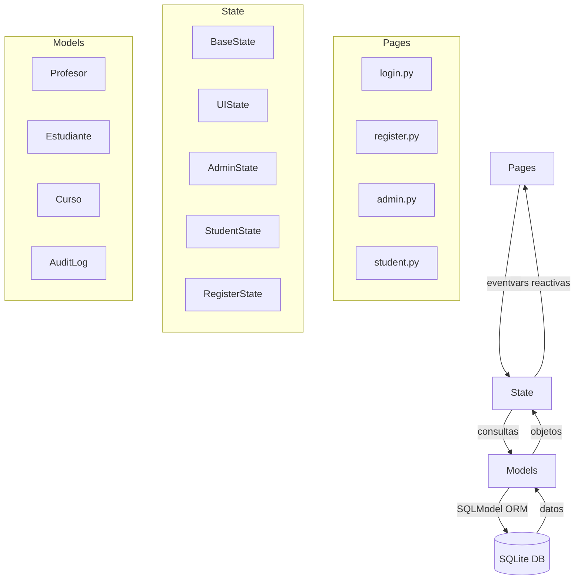

<p align="center">
  <h1 align="center">Gestor de Cursos Escolares (GCE)</h1>
  <p align="center">
    <em>School Course Management System — Built with Reflex &amp; SQLModel</em>
  </p>
</p>

<p align="center">
  
  
  
  
  
</p>

---

## Características

La aplicación cuenta con dos roles de usuario principales: **Administrador** y **Estudiante**.

### Administrador

- **Gestión de Cursos:** Crear, leer, actualizar y eliminar cursos.
- Ver una lista de todos los cursos con su información detallada.
- Asignar profesores a los cursos (principal y suplente).
- Establecer el número de cupos para cada curso.

### Estudiante

- **Inscripción a Cursos:** Ver cursos inscritos y disponibles.
- Inscribirse y darse de baja de los cursos.
- Ver los detalles de cada curso, incluyendo el profesor, el horario y la descripción.
- Validación de conflictos de horario y límite de cursos.

### Registro

- Registro de nuevos estudiantes con validación de email y contraseña.

---

## Arquitectura

GCE sigue el patrón **Reflex State** — una arquitectura unidireccional donde la UI se renderiza declarativamente y los cambios de estado disparan re-renderizados automáticos.



### Jerarquía de State

| State | Hereda de | Responsabilidad |
|-------|-----------|-----------------|
| `BaseState` | `rx.State` | Datos compartidos, autenticación, helpers |
| `UIState` | `BaseState` | Modales y flags de UI |
| `AdminState` | `UIState` | CRUD de cursos, estudiantes y profesores |
| `StudentState` | `UIState` | Inscripción, baja, validaciones de horario |
| `RegisterState` | `UIState` | Registro de nuevos estudiantes |

---

## Tech Stack

| Tecnología | Propósito |
|-----------|-----------|
|  | Lenguaje principal |
|  | Framework web fullstack |
|  | ORM / modelos de datos |
|  | Base de datos embebida |
|  | Estilos (via Reflex plugin) |
|  | Hash de contraseñas |

---

## Instalación y Configuración

Sigue estos pasos para configurar y ejecutar el proyecto en tu máquina local.

### Prerrequisitos

- Python 3.8 o superior
- pip

### Pasos de Instalación

1. **Clona el repositorio:**

   ```bash
   git clone https://github.com/maur-ojeda/gce.git
   cd gce
   ```

2. **Crea un entorno virtual:**

   ```bash
   python -m venv .venv
   source .venv/bin/activate
   ```
   *En Windows, usa `.venv\Scripts\activate`*

3. **Instala las dependencias:**

   ```bash
   pip install -r requirements.txt
   ```

4. **Inicializa y ejecuta la aplicación:**

   ```bash
   reflex init
   reflex run
   ```

La aplicación estará disponible en `http://localhost:3000`.

---

## Estructura del Proyecto

```
/
├── gce/
│   ├── __init__.py
│   ├── gce.py                # Punto de entrada de la aplicación
│   ├── models.py             # Modelos de datos (SQLModel)
│   ├── database.py           # Configuración de BD y seed data
│   ├── components/           # Componentes reutilizables de UI
│   │   ├── cards.py          # Tarjetas de cursos
│   │   ├── forms.py          # Formularios
│   │   ├── layout.py         # Layout con navbar
│   │   └── navbar.py         # Barra de navegación
│   ├── pages/                # Páginas/rutas de la aplicación
│   │   ├── admin.py          # Vista del administrador
│   │   ├── student.py        # Vista del estudiante
│   │   ├── login.py          # Login por rol
│   │   └── register.py       # Registro de estudiantes
│   └── state/                # Estado reactivo (Reflex State)
│       ├── base.py           # BaseState — datos compartidos
│       ├── ui.py             # UIState — modales y flags
│       ├── admin.py          # AdminState — CRUD
│       ├── student.py        # StudentState — inscripción
│       └── register.py       # RegisterState — registro
├── requirements.txt          # Dependencias de Python
├── rxconfig.py               # Configuración de Reflex
└── LICENSE                    # MIT License
```

---

## Uso

Una vez que la aplicación esté en funcionamiento, puedes acceder a las siguientes rutas:

| Ruta | Descripción |
|------|-------------|
| `/` | Página de inicio (redirige a login) |
| `/login` | Selección de rol |
| `/register` | Registro de nuevo estudiante |
| `/admin` | Panel de administración |
| `/estudiante` | Vista del estudiante |

---

## License

This project is licensed under the MIT License — see the [LICENSE](LICENSE) file for details.